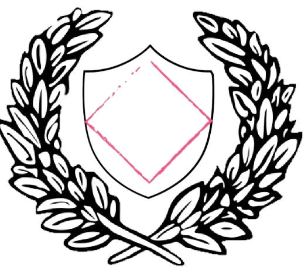

# CodeShield - HackMyVM (Easy)

## Übersicht

*   **VM:** Codeshield
*   **Plattform:** [HackMyVM](https://hackmyvm.eu/machines/machine.php?vm=Codeshield)
*   **Schwierigkeit:** Easy
*   **Autor der VM:** DarkSpirit
*   **Datum des Writeups:** 2023-09-27
*   **Original-Writeup:** https://alientec1908.github.io/Codeshield_HackMyVM_Easy/
*   **Autor:** Ben C.

## Kurzbeschreibung

Die virtuelle Maschine "Codeshield" von HackMyVM (Schwierigkeitsgrad: Easy) bot einen Pfad zur Kompromittierung, der mit der Ausnutzung eines anonymen FTP-Zugangs begann. Über heruntergeladene PDF-Dateien konnten Benutzerinformationen und eine Liste potenzieller Passwörter extrahiert werden. Ein Brute-Force-Angriff auf den FTP-Dienst mit diesen Informationen führte zu gültigen Credentials. Der initiale Zugriff erfolgte via SSH. Die Privilegienerweiterung erfolgte in mehreren Schritten durch das Auffinden weiterer Passwörter in Thunderbird-Maildateien und einer Bash-History, die schließlich zum Benutzer `earlyp` führten. Dieser Benutzer war Mitglied der `lxd`-Gruppe, was eine direkte Eskalation zu Root-Rechten ermöglichte.

## Disclaimer / Wichtiger Hinweis

Die in diesem Writeup beschriebenen Techniken und Werkzeuge dienen ausschließlich zu Bildungszwecken im Rahmen von legalen Capture-The-Flag (CTF)-Wettbewerben und Penetrationstests auf Systemen, für die eine ausdrückliche Genehmigung vorliegt. Die Anwendung dieser Methoden auf Systeme ohne Erlaubnis ist illegal. Der Autor übernimmt keine Verantwortung für missbräuchliche Verwendung der hier geteilten Informationen. Handeln Sie stets ethisch und verantwortungsbewusst.

## Verwendete Tools

*   `arp-scan`
*   `vi`
*   `nikto`
*   `nmap`
*   `ftp`
*   `telnet` (im Tool-Verzeichnis gelistet, aber nicht explizit im Ablauf verwendet)
*   `dirsearch`
*   `strings`
*   `username-anarchy`
*   `cat`
*   `awk`
*   `rm`, `mv`
*   `hydra`
*   `ssh`
*   `grep`
*   `su`
*   `sudo`
*   `find`
*   `nc` (für KDBX-Transfer)
*   `lxc`
*   Standard Linux-Befehle (`ls`, `cd`, `id`)

## Lösungsweg (Zusammenfassung)

Der Angriff auf die Maschine "Codeshield" erfolgte in folgenden Phasen:

1.  **Reconnaissance:**
    *   Ziel-IP (`192.168.2.132`, Hostname `codeshield.hmv`) via `arp-scan` und `/etc/hosts`-Eintrag identifiziert.
    *   `nikto` auf Port 80 zeigte eine Umleitung auf HTTPS.
    *   `nmap` identifizierte zahlreiche offene Ports, darunter kritisch:
        *   FTP (21) mit vsftpd 3.0.5 und **erlaubtem Anonymous Login**.
        *   SSH (22, 2222) mit veraltetem OpenSSH 6.0p1.
        *   SSH (22222) mit neuerem OpenSSH 8.9p1.
        *   HTTPS (443) mit Nginx.
        *   Weitere Mail-Dienste und RDP.

2.  **Credential Gathering (FTP & PDF Analyse):**
    *   Anonymer FTP-Login auf Port 21 ermöglichte den Download von drei PDF-Dateien: `CodeShield_pitch_deck.pdf`, `Information_Security_Policy.pdf`, `The_2023_weak_password_report.pdf`.
    *   Aus den PDFs wurde die E-Mail `j.carlson@codeshield.hmv` (potenzieller Benutzer `j.carlson`) und eine Liste von 10 schwachen Passwörtern extrahiert.
    *   `username-anarchy` wurde verwendet, um aus Namen weitere potenzielle Benutzernamen zu generieren.
    *   `hydra` wurde mit den gesammelten Benutzer- und Passwortlisten gegen den FTP-Dienst (Port 21) ausgeführt und fand die Zugangsdaten: `valdezk`:`Greatplace2work!`.

3.  **Initial Access (SSH als valdezk):**
    *   FTP-Login als `valdezk` bestätigte den Zugriff und listete weitere Benutzer-Home-Verzeichnisse auf.
    *   Erfolgreicher SSH-Login auf Port 22222 als `valdezk` mit dem Passwort `Greatplace2work!`.

4.  **Privilege Escalation (valdezk zu mitchellt):**
    *   Im Home-Verzeichnis von `valdezk` wurde mit `grep` in Thunderbird-Maildateien das Passwort `D@taWh1sperer!` gefunden.
    *   Mit `su mitchellt` und dem Passwort `D@taWh1sperer!` wurde erfolgreich zum Benutzer `mitchellt` gewechselt.
    *   Die User-Flag wurde aus `/home/mitchellt/user.txt` gelesen.

5.  **Privilege Escalation (mitchellt zu earlyp):**
    *   Die `.bash_history` des Benutzers `mitchellt` enthielt einen Befehl, der das Passwort für den Benutzer `earlyp` im Klartext offenbarte: `EARL!YP7DeVel@OP`.
    *   Mit `su earlyp` und diesem Passwort wurde erfolgreich zum Benutzer `earlyp` gewechselt.
    *   Im Home-Verzeichnis von `earlyp` wurde eine KeepassXC-Datenbankdatei (`Passwords.kdbx`) gefunden und via `nc` zum Angreifer-System übertragen (deren Inhalt wurde im weiteren Verlauf nicht benötigt).

6.  **Privilege Escalation (earlyp zu root via LXD):**
    *   Der Befehl `id` als `earlyp` zeigte die Mitgliedschaft in der Gruppe `lxd`.
    *   Die Standard-LXD-Privilege-Escalation-Technik wurde angewendet:
        1.  Ein vorhandenes LXD-Image wurde verwendet (`lxc image list`).
        2.  Ein privilegierter Container wurde initialisiert: `lxc init <IMAGE_FINGERPRINT> test -c security.privileged=true`.
        3.  Das Root-Dateisystem des Hosts wurde in den Container gemountet: `lxc config device add test whatever disk source=/ path=/mnt/root recursive=true`.
        4.  Der Container wurde gestartet: `lxc start test`.
        5.  Eine Shell im Container wurde ausgeführt: `lxc exec test bash`.
    *   Innerhalb der Container-Shell wurde auf `/mnt/root/root/root.txt` zugegriffen und die Root-Flag gelesen.

## Wichtige Schwachstellen und Konzepte

*   **Anonymer FTP-Zugang:** Erlaubte den Download sensibler Dokumente.
*   **Informationslecks in Dokumenten:** Preisgabe von E-Mail-Adressen und Passwortlisten in PDFs.
*   **Schwache/Wiederverwendete Passwörter:** Ermöglichten Brute-Force-Erfolg und laterale Bewegungen.
*   **Klartext-Passwörter in Bash-History:** Offenlegung von Zugangsdaten für andere Benutzer.
*   **Veraltete Software-Versionen:** OpenSSH 6.0p1 (obwohl nicht direkt ausgenutzt, ein Risiko).
*   **LXD Privilege Escalation:** Mitgliedschaft in der `lxd`-Gruppe ermöglichte Root-Zugriff durch Container-Manipulation.
*   **Keepass-Datenbank-Fund:** Obwohl nicht direkt für den Root-Pfad verwendet, ein typischer Ort für Credential Storage.

## Flags

*   **User Flag (`/home/mitchellt/user.txt`):** `Your_password_is_the_key_to_your_digital_life`
*   **Root Flag (aus Container: `/mnt/root/root/root.txt`):** `Educate_your_employees_on_password_safety`

## Tags

`HackMyVM`, `Codeshield`, `Easy`, `FTP`, `Anonymous FTP`, `PDF Analysis`, `Brute-Force`, `Hydra`, `SSH`, `Password Reuse`, `Bash History`, `LXD`, `Privilege Escalation`, `Linux`
